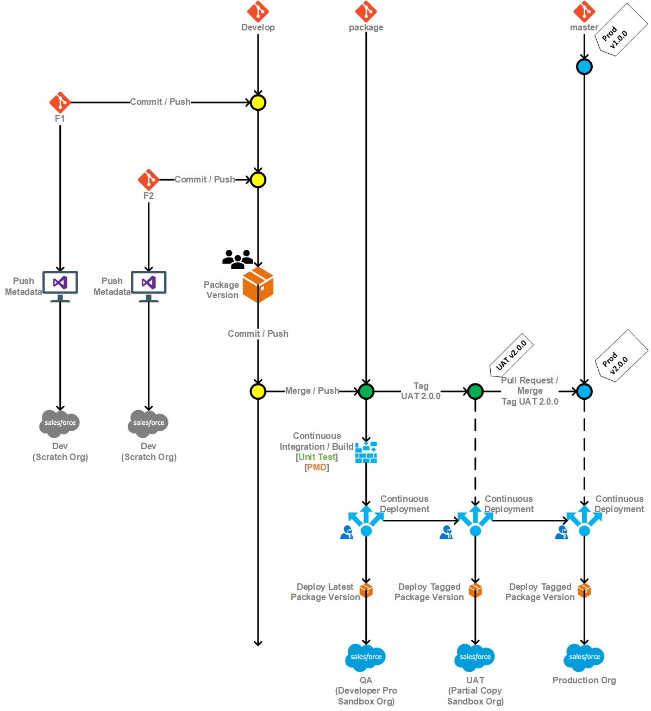

# Git Strategy

### Overview:

A key part of the application lifecycle is defining where the code and related assets for development efforts will live, how they will be versioned, and how to support multiple releases across different components \(SFDX packages\) as well as multiple projects & team members per component. This document outlines specific aspects of those different sections of the ALM and how they all work together to support a seamless CI / CD pipeline. To better build a more complete understanding of how we will leverage GIT and branching, this document has been broken down into three different sections:

* [Repository Definition / Package Structure](https://github.com/ECFMG/salesforce-unlocked-packages-guide/wiki/Git-Strategy#repository-definition--package-structure)
* [Branching Strategy](https://github.com/ECFMG/salesforce-unlocked-packages-guide/wiki/Git-Strategy#branching-strategy)
* [CI / CD Integration](https://github.com/ECFMG/salesforce-unlocked-packages-guide/wiki/Git-Strategy#continuous-integration--continuous-delivery)

The aforementioned topics are interrelated and integral to building an understanding on how to will be leverage GIT for development and release; by the end of this document, you should have sufficient understanding of the process to begin building within the framework outlined here.

### Repository Definition / Package Structure:

This section assumes that you have some basic knowledge of SFDX \(SalesForce Developer Experience\) and package based deployments - if you are not familiar with SFDX or package based deployments, please consult [Trailhead ](https://trailhead.salesforce.com/content/learn/trails/sfdx_get_started)before continuing. Within SFDX, the concept of a package is integral and is the core asset by which you will be progressing through the different environments, all the way up to production. That being said, the bounds of the functionality contained within a package can at times be a judgment call. Ideally, a package should encapsulate a well defined \(and related\) set of features and should be as small \(atomic\) as we can feasibly make it. We want to avoid large, monolithic, packages that have multiple reasons for change; packages should, as much as is reasonable, be well defined and small \(think open/closed principle from SOLID\). That being said, in our git strategy, packages correspond one-to-one with repositories, to help enforce separation of concerns between packages and better define who has access to work on / change individual packages. This also allows us to think of packages as each defining a unique set of features which can have its own set of parallel development efforts \(branches\) and differing versions.

### Branching Strategy:

**TO-DO:** [Read Thoughtworks Guidance on Trunk Based Deployment Pipelines](https://www.thoughtworks.com/insights/blog/enabling-trunk-based-development-deployment-pipelines)

Now that we've defined what we will have in git from a repository / SFDX project perspective, we can now discuss how we will be leveraging branches within those repositories to accomplish parallel development efforts and versioning. We are, in general, adhering to the established [GitFlow pattern](https://datasift.github.io/gitflow/IntroducingGitFlow.html), but with a few SalesForce DX caveats - to accommodate the differences between traditional custom development and what's needed for developing in SalesForce DX. At the core of our strategy is that we will have a lot of branches - with five core types of work branches at any given time - they are the following \(with generally only three guaranteed to exist: master, develop, and package\):

* **Master**: This can generally be thought of as being an accurate representation of what we have in production at any given time. Each repository has a master \(named "master"\) branch by default.
* **Develop**: The "Develop" branch is the sum of all current features under development for a future planned release - inline with this thinking is the idea that we should only be testing one release at a time, though we can be developing many features in parallel. The "Develop" branch can be generally thought of as related to "Integration", "QA", or "UAT", but this is not always the case. A core tenet of our strategy is that we want to blur the lines between environments and branches. Branches are meant to capture the concepts or "latest production release" \(master\), "release in testing" \(develop\), and "feature under development" \(feature\). The develop branch is a pull from the latest of what exists in master, plus what is currently being developed in a feature. It is, quite literally, a feature branch "integrated into what is currently released" so that testing for release can now happen.
* **Package**: Even if you're familiar with Git and the GitFlow pattern, this will be new for you. This is part of the new paradigm of deploying SalesForce DX projects. Code is no longer re-compiled at each step before deployment. There is a deliberate packaging step performed when we reach a milestone in development and testing - and are now ready for a new version. It is not enough to say that our code can compile, the artifact that moves between environments is now a "SalesForce DX unlocked package" - and we need to test that this artifact is produced correctly. The reason we have added the package branch is to have an easy way to see / pull-up all package versions over time. Our CI/CD pipeline will be driven by the latest package committed to this branch.
* **Feature / Hot Fix**: This can be thought of as a work stream or current development effort - a new project would be developed on a feature branch. This branch represents the most recent \(stable\) version of the feature under development. **Personal Branches**: As part of the development pipeline, there is now a review process \(more on that later\), but developers who are actively adding changes will be doing so on a branch which is created from \(based on\) the feature branch. A given developer's changes will be committed to their own personal branch based off of a given feature. When the developer believes their changes are ready to be pulled into the feature branch - the developer will issue a pull request to have their branch pulled into the feature. At which time their request will be reviewed by a peer to confirm if the changes are ready - if so they will be pulled in at that time. 

### Continuous Integration / Continuous Delivery:

Now that we have an understanding of how the code will be structured, branched, and released, we need to understand how we can promote these changes through the different environments - after all, the code is no good without a successful deployment so it can be walked through its paces and used in a SalesForce org. I'll walk a standard update through its paces \(simplest use-case for ease of setting the stage\) and by the end, you should have an understanding of what's involved in getting your updates in the hands of QA resources and Business Owners.

#### Sample Feature Development Flow:

1. A new feature has been requested by the business for account management package, so at the start of the development process a new feature branch is created "account\_management/cool\_business\_feature".
2. Bob, one of our developers, pulls a work ticket off of the stack located on Azure Boards and creates a personal branch off of the "cool\_business\_feature" branch, does his work for that ticket, writes his tests, tests on his personal scratch org and has determined it's good enough \(in his opinion\) to go into the feature branch - so he submits a pull request to get his change pulled into the "cool\_business\_feature" branch.
3. Jane, on of our senior developers, and a code reviewer for this package, sees Bob's request, gets the latest off of the feature branch, merges in his pull request locally and reviews his changes on her local scratch org. Assuming everything checks out \(good job Bob!\), she merges his pull request and as a side effect, his personal branch is now deleted and his work for this feature is now available for all of the other developers on the team.
4. Assuming \(for the sake of this story\) Bob completes a few more tasks, they run through review and everything looks good. The decision is made, by the team - at stand-up, that they are ready to get this feature in for testing. Jane merges in the feature branch into "develop" and conducts local testing on her personal scratch org \(develop now consists of all feature development of Bob's team + anything else that may have gone into developing during that same timespan\) and if everything checks out still, she creates a new versioned DX package containing all of the newest updates and places this package in the package branch.
5. Once the package branch has been updated with the latest version, the CI/CD pipeline detects the new package \(change in Git\) and deploys this to our QA environment for testing.
6. From here, the QA team validates the changes, and if they find nothing, gives the approval to move the package from QA to UAT / STAGING. If they find issues, they will submit tickets in Azure DevOps, which will be worked on by Bob & Jane in their personal branches \(based off of the feature, branch\), pulled into the feature branch, then develop, and finally package… Which leads us back to this step.
7. Once reviewed by all appropriate stakeholders and approved, we move the latest validated package to our production org.

-- Mike Mocarski  

