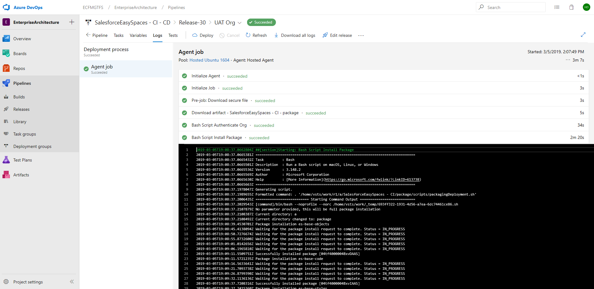
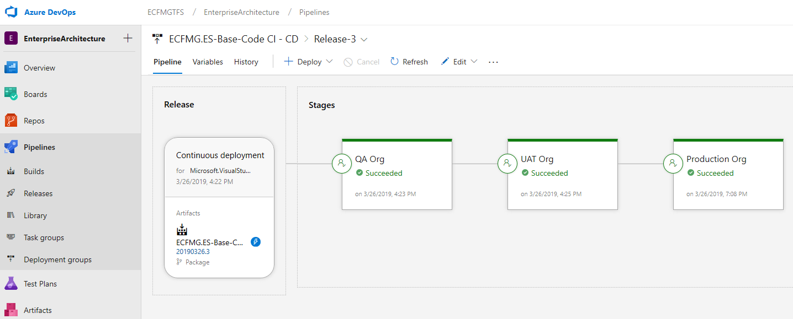

# Pipeline Introduction

## Introduction

Creating a pipeline automates many of the activities involved in development and helps to make processes more efficient and increases team throughput.

This section will explore setup and configuration leveraging Azure DevOps.

### Technical Considerations

Guidance in this document provides details on some products that the team who developed are familiar with, but the approach would be the same regardless of the tools used.

* [Azure Pipelines](https://docs.microsoft.com/en-us/azure/devops/pipelines/?view=azure-devops) - Continuous integration and continuous delivery \(CI/CD\) that works with any language, platform, and cloud.
* [Azure Repos](https://docs.microsoft.com/en-us/azure/devops/repos/index?view=azure-devops) - Unlimited cloud-hosted private Git and Team Foundation Version Control \(TFVC\) reports for your project.
* [Azure Boards](https://docs.microsoft.com/en-us/azure/devops/boards/index?view=azure-devops) - Work tracking with boards, backlogs, team dashboards, and custom reporting.
* [Azure Test Plans](https://docs.microsoft.com/en-us/azure/devops/test/index-tp?view=azure-devops) - All-in-one planned and exploratory testing solution.
* Visual Studio Code - IDE used in tandem with Salesforce DX plugin to write edit, and deploy code into the repos.

### Set-up Salesforce for Continuous Delivery

In order for Salesforce to receive new automated headless deployment, below are a few settings:

1. [Create a Self-Signed SSL Certificate and Private Key](https://trailhead.salesforce.com/en/content/learn/modules/sfdx_travis_ci/sfdx_travis_ci_connected_app#Tdxn4tBK-heading4)
2. [Create the Connected App](https://trailhead.salesforce.com/en/content/learn/modules/sfdx_travis_ci/sfdx_travis_ci_connected_app#Tdxn4tBK-heading5)

    Important!  
    Be sure to copy down the consumer key—you’ll use it later

3. [Edit Policies](https://trailhead.salesforce.com/en/content/learn/modules/sfdx_travis_ci/sfdx_travis_ci_connected_app#Tdxn4tBK-heading8)

### Azure Pipelines
Automate your Salesforce builds, test, and deployments with Azure Pipelines so you spend less time with the nuts and bolts and more time being creative.

Azure Pipelines is a fully featured continuous integration (CI) and continuous delivery (CD) service. It works with your preferred Git provider and can deploy to most major cloud services, which include Salesforce. Start with your code on GitHub, GitHub Enterprise Server, GitLab, Bitbucket Cloud, or Azure Repos. Then you can automate the build, testing, and deployment of your code to Salesforce.

## What do I need to use Azure Pipelines?

To use Azure Pipelines, you need:

* An organization in Azure DevOps.
* To have your source code stored in a version control system.

## Why should I use CI and CD and Azure Pipelines?
Implementing CI and CD pipelines helps to ensure consistent and quality code that's readily available to users.

Azure Pipelines is a quick, easy, and safe way to automate building your projects and making them available to users.

### Use CI and CD for your project

Continuous integration is used to automate tests and builds for your SFDX project. CI helps to catch bugs or issues early in the development cycle, when they're easier and faster to fix. Items known as artifacts are produced from CI systems. They're used by the continuous delivery release pipelines to drive automatic deployments.

Continuous delivery is used to automatically deploy and test code in multiple stages to help drive quality. Continuous integration systems produce deployable artifacts, which includes infrastructure, apps and packages. Automated release pipelines consume these artifacts to release new versions and fixes to the target of your choice. 

| Continuous integration (CI)                    |  Continuous delivery (CD)                      |
| -----------------------------------------------|------------------------------------------------|
| Increase code coverage.                         | Automatically deploy code to production.        |
| Build faster by splitting test and build runs.  | Ensure deployment targets have latest code.     |
| Automatically ensure you don't ship broken code.| Use tested code from CI process.
| Run tests continually.                          |

### Use Azure Pipelines for CI and CD

There are several reasons to use Azure Pipelines for your CI and CD solution. You can use it to:

* Work with any language or platform.
* Deploy to different types of targets at the same time.
* Integrate with Salesforce deployments.
* Build on Linux machines.
* Integrate with GitHub, Azure Repos or Bitbucket.
* Work with open-source projects.
* Pre-defined environment variable, other options are variable groups and azure key vault
* Alternatively you can save a template for build and release pipeline to streamline the deployment process.
* Once CI-CD pipeline is ready you can export it
* you can add approvers at each stage of deployment

Resources

Trailhead Module
https://trailhead.salesforce.com/content/learn/modules/sfdx_travis_ci/sfdx_travis_ci_connected_app
